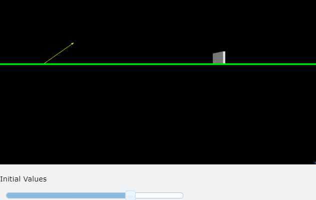
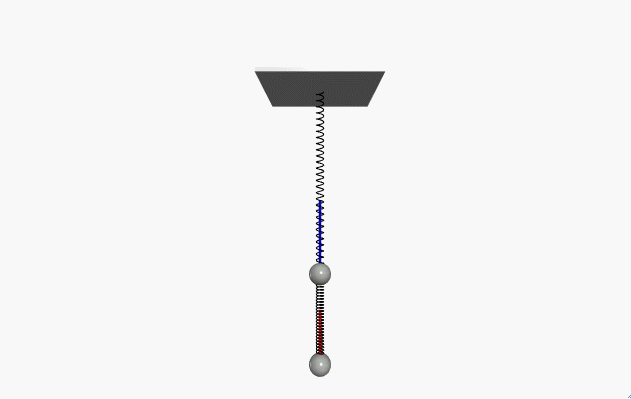
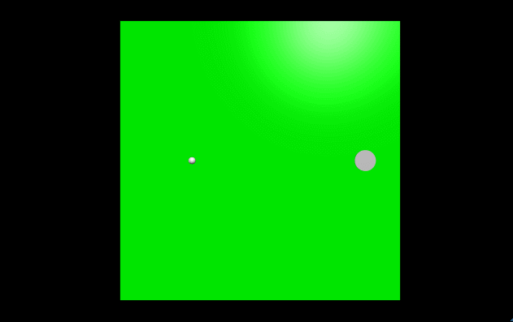
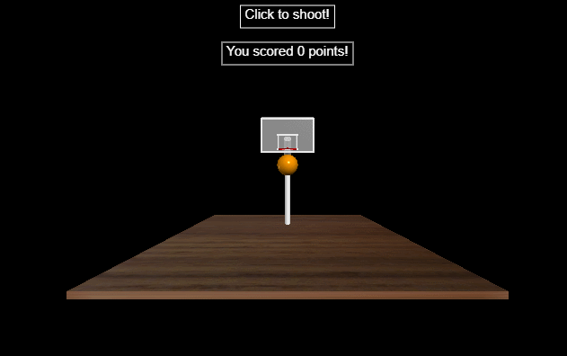

# General Physics and Simulation

This repository is for **General Physics and Simulation** lecture related material and assignments  
I've not uploaded lecture materials due to copyright issues.  
All lecture related materials are based on: [K-MOOC Physics Codin' with glowscript](http://www.kmooc.kr/courses/course-v1:SejonguniversityK+SJMOOC09K+2019_03SJ9_R3/about)

---
## Summary

### Assignments

</img>
</img>
</img>
</img>

### Final term project: basketball clicker game

</img>

---

## Library
VPython 2.7 based on WebGL  
For more information visit: [Glowscript](https://www.glowscript.org/)
